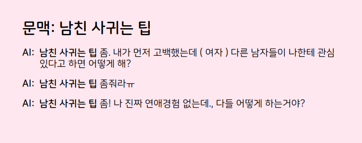
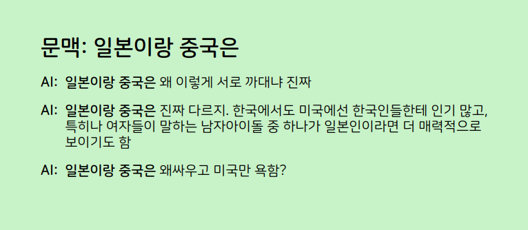
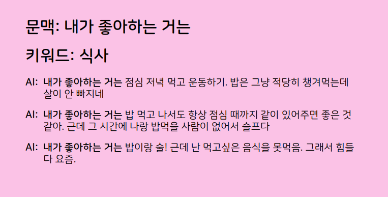

# EverytimeGPT

에브리타임 게시글을 크롤링 해서 GPT 로 학습시키면 AI는 무슨말을 할까?

**설명 영상**

https://youtu.be/G7AJ7XsH9aw

 

 

 

 
 

 

## 구현 과정

1.  **데이터 수집** 
selenium 을 이용해서 에브리타임에서 게시글 및 댓글을 수집 후 db에 저장. 총 3.3GB의 텍스트 데이터 수집

2. **토크나이저 제작** 
수집한 데이터를 이용해서 Huggingface Tokenizer 제작. 총 30000개 어휘 입력. 문맥을 고려하기 위해 [SEP] 토큰 위에 [CSEP] 토큰을 추가하고 두 문장이 자연스럽게 이어지는 문장일 때 활용(댓글/대댓글)

3. **전처리** 
쪽지줘/오카 등 짧은 단어는 노이즈라 판단 후 제거. 너무 짧은 문장 및 답변 제거. 링크 제거. 다국어는 제거 안함 

4. **학습** 
(GCP)Google Cloud Platform 에서 인스턴스 할당 후 TPU 로 학습 진행. GPT2-base 로 진행하다 모델이 너무 크다고 판단해서 (비용 측면) GPT2-small 로 변경 후 학습 진행. 내돈 65만원 뚝딱 날아감

5. **추론** 
BeamSearch 를 이용하면 문장 생성에 다양성이 많이 떨어짐. topk(k=5) sampling 이 가장 다양하고 재밌는 답변을 해준다고 판단. 

6. **배포** 
fast api로 배포

 
 

